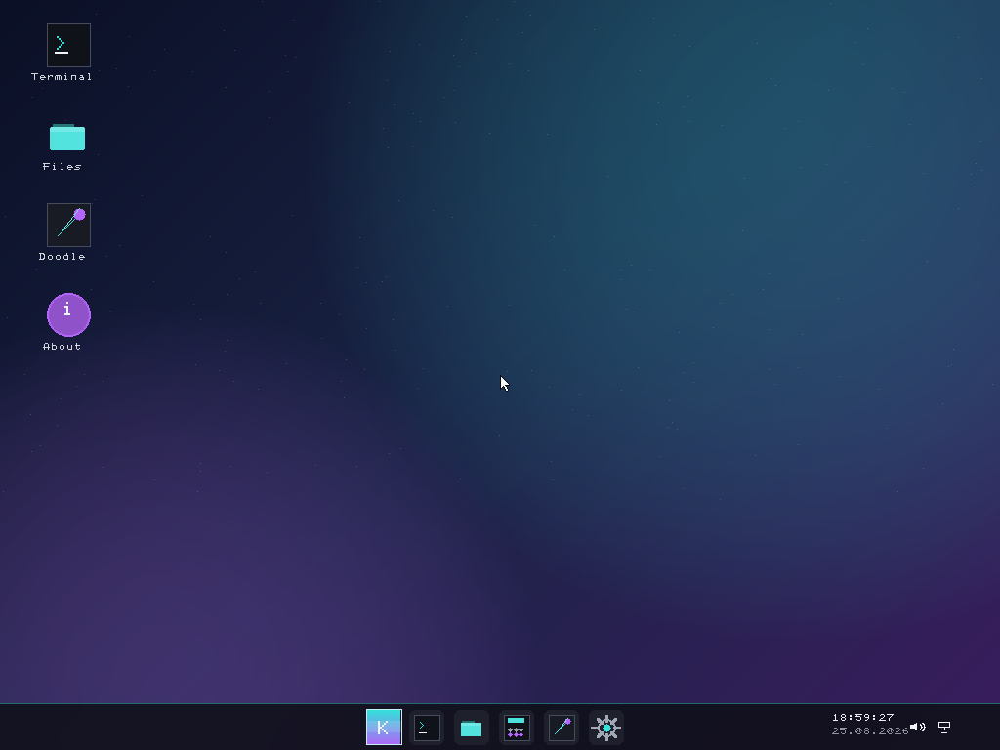
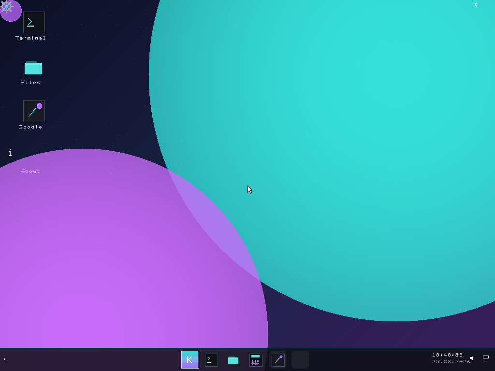

# KiKOS.11

A from-scratch 32-bit hobby operating system with a full graphical desktop, built entirely in C and x86 assembly. No Linux, no GRUB — just raw hardware.



## Features

### Desktop Environment
- **Aurora wallpaper** with animated glow orbs and vignette
- **Frosted taskbar** with system tray (clock, Wi-Fi, battery, speaker)
- **Start menu** with live search filtering across 12 built-in apps
- **Command Palette** (`Ctrl+K` / `F1`) — type any app or command to launch it
- **Right-click context menu** with quick access to Night light, Focus, Mood, Glance
- **Desktop icons** with double-click to open
- **Window management** — drag, resize, minimize, maximize, close
- **Aero Snap** — drag to left/right edge for half-screen, corners for quarter-screen, top for maximize
- **Glance panel** (`F5`) — slide-in dashboard with live clock, memory bar, uptime, quick toggles
- **Quick Settings** — Wi-Fi, Bluetooth, Airplane mode, Night light, volume & brightness sliders
- **Notification toasts** — slide-in cards with the KiKOS branding

### Visual Identity
- **Branded window chrome** — accent-colored title bars with breathing glow, circular "K" close button
- **Mood mode** — dynamic accent that slowly cycles through hues, re-rendering the wallpaper live
- **Adaptive theme** — auto-switches between Aurora and Ocean based on time of day
- **Focus mode** — dims inactive windows for distraction-free work
- **Night light** — warm amber overlay for late-night use
- **Aura cursor trail** — glowing particle trail follows the mouse across the desktop
- **Screensaver** — 3D starfield after 20s of inactivity

### Built-in Apps

| App | Description |
|-----|-------------|
| **Terminal** | VFS-backed shell with `ls`, `cat`, `mkdir`, `rm`, `cp`, `mv`, `find`, `grep`, `echo`, `df`, `mem`, `uptime`, `theme`, and more |
| **Files** | 3-pane file browser with navigation, list, and preview panes |
| **Calculator** | Full arithmetic calculator with a button grid |
| **Text Editor** | Line numbers, syntax highlighting, cursor, scrollbar |
| **Doodle** | Paint app with color palette and freehand drawing |
| **Image Viewer** | Procedural image generation and display |
| **Music Player** | Playlist, now-playing view, waveform, play/pause/seek controls |
| **System Monitor** | 4-tab view: processes, performance graphs, system info, network |
| **Antivirus** | Animated shield scan with progress bar and threat log |
| **Settings** | 6 categories: Personalization, System, Input, Display, Privacy, About |
| **About** | System information and credits |
| **Snake** | Classic snake game with score tracking |

### Keyboard Shortcuts

| Key | Action |
|-----|--------|
| `F1` | Toggle Command Palette |
| `F2` | Toggle Night light |
| `F3` | Toggle Focus mode |
| `F4` | Toggle Mood (dynamic accent) |
| `F5` | Toggle Glance panel |
| `F6` | Toggle Quick Settings |
| `F7` | Toggle Adaptive theme |
| `F8` | Cycle wallpaper (Aurora / Sunset / Ocean / Mono) |
| `Ctrl+K` | Command Palette |
| `Win` key | Toggle Start menu |

## Building

### Requirements
- `gcc` (32-bit, cross-compiler or multilib)
- `nasm`
- `ld` (GNU, ELF i386 target)
- `make`
- `qemu-system-i386` (for testing)

### Build & Run
```bash
make clean && make -j$(nproc) all
./run.sh
```

### Build & Run (headless, for CI/testing)
```bash
qemu-system-i386 -m 256 -vga std \
  -drive file=build/kikos.img,format=raw,if=ide \
  -display none -serial file:/tmp/kikos.log
```

## Architecture

```
boot/
  stage1.asm        MBR bootloader (512 bytes)
  stage2.asm        Loads kernel via LBA disk reads
kernel/
  linker.ld         Linker script (32-bit, flat binary)
  src/
    entry.asm       Protected mode entry, sets up stack
    idt.c/h         Interrupt Descriptor Table
    isr.asm         ISR stubs
    ps2kbd.c/h      PS/2 keyboard driver (IRQ 1)
    ps2mouse.c/h    PS/2 mouse driver (IRQ 12)
    timer.c/h       PIT timer (IRQ 0, 100 Hz)
    rtc.c/h         Real-time clock
    gfx.c/h         Framebuffer, drawing primitives, wallpaper
    font.c          8x8 bitmap font (ASCII 32-127)
    icons.c/h       20 procedural icons
    gui.c/h         Window manager, taskbar, desktop, all overlays
    login.c/h       Lock screen with animated orb
    kmain.c         Kernel main loop (input → GUI frame)
    lib.c/h         strlen, strcmp, memcpy, itoa, etc.
    mm.c/h          Heap allocator (first-fit)
    vfs.c/h         Virtual filesystem (in-memory tree)
    fs.c/h          Filesystem abstraction
    apps.h          App IDs and draw/mouse prototypes
    app_*.c         12 built-in applications
    process.c/h     Process scheduler (dormant)
    ahci.c/h        AHCI/SATA driver (dormant)
    pci.c/h         PCI bus enumeration (dormant)
    net.c/h         Network stack: ARP, IP, ICMP, TCP (dormant)
    paging.c/h      Virtual memory / page tables (dormant)
    power.c/h       ACPI power off, reboot
    pcspk.c/h       PC speaker beep
    firewall.c/h    Packet filter rules
    antivirus.c/h   Signature-based scanner
    pkgmgr.c/h      Package manager stubs
    com1.c/h        Serial port output
    syscall.c/h     Syscall interface stubs
scripts/
  genfont.py        Font generation script
  padcheck.py       Kernel size guard (max 448KB)
```

## Dormant Subsystems

These are implemented but not yet wired into the boot sequence:
- **Process scheduler** — preemptive, 16 priority queues, context switch via inline asm
- **Paging** — frame allocator, page tables, `kmalloc_page`/`kfree_page`
- **AHCI** — SATA disk driver with read/write/identify
- **PCI** — full bus scan, BAR access, MSI enable
- **Network** — ARP, IP, ICMP echo reply, TCP connect, BSD socket API

## Screenshots




## License

This is a hobby/educational project. Use however you like.
